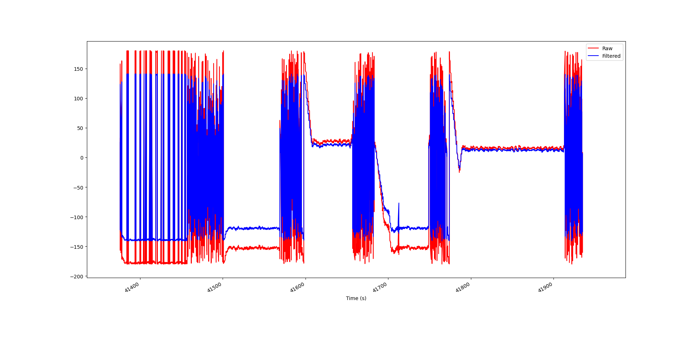

# Фильтрация WTG-сообщений

На графике изображена фильтрация фильтром Баттерворта курса из WTG-сообщений (VTG_and_WTG.log)

Красным изображен неотфильтрованные данные, синим - отфильтрованные. Курс колеблется около 180 градусов (ноль на графике).

Параметры фильтра: 

Порядок - 4

Частота среза - 5 Гц

Частота дискретизации - 15 Гц.

# CAN-шина

CAN-шина (Controller Area Network) — это последовательная сеть, которая позволяет множеству устройств обмениваться данными. Она обычно используется в автомобильной промышленности для связи между различными электронными модулями.

Шина состоит из двух проводов: CAN-High и CAN-Low. По этим проводам передаются данные в виде дифференциальных сигналов. Сигнал “1” означает, что напряжение на CAN-High выше, чем на CAN-Low, а сигнал “0” — наоборот.

Общение устройств в CAN-сети происходит по принципу master-slave. Каждое устройство имеет свой уникальный идентификатор (ID), который определяет его приоритет при отправке данных. Устройство с меньшим ID имеет больший приоритет. Если несколько устройств пытаются отправить данные одновременно, устройство с большим приоритетом отправляет свои данные первыми, а остальные устройства ждут своей очереди.

Конфликты могут возникнуть, если два устройства попытаются использовать шину одновременно, но это можно предотвратить, используя разные методы, такие как расширение идентификаторов или использование фильтров.

Эффективная пропускная способность шины BUS (т.е. полезной нагрузки без рабочих заголовков фрейма) составляет примерно 87.5% от номинального битрейта. Таким образом, при заявленной пропускной способности шины 500 кбит/с, эффективная скорость передачи данных составляет 437.5 кбит/с.